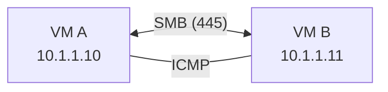
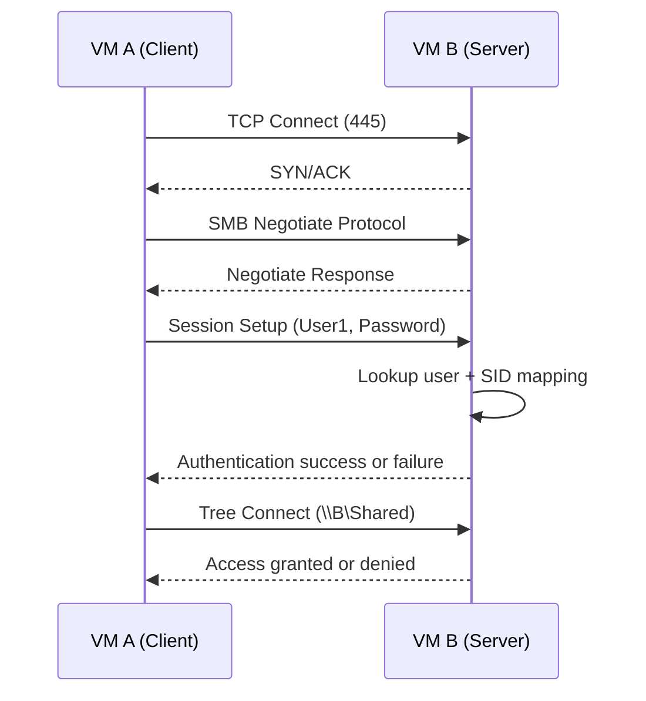
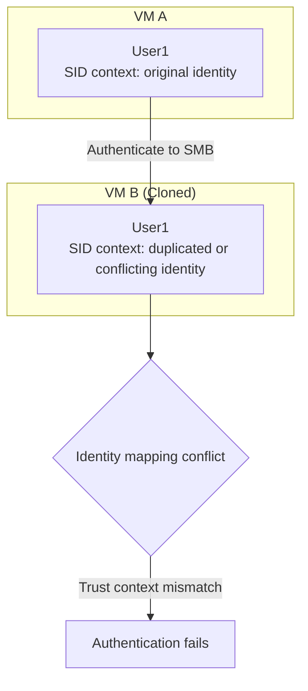

## Reproducible Lab Guide: VM Cloning Authentication Failure

**Date:** 2026-03-04

> See the companion case study: `/case-studies/vm-cloning-auth-failure`

---

## Objective

Build a peer-to-peer Windows network using virtual machines, reproduce an authentication failure caused by improper VM cloning, and then fix it.

---

## Lab Requirements

- 2 to 3 Windows virtual machines
- Virtual network on the same subnet
- Administrator access on all systems

---

## Environment

- **Platform:** Virtual machines in a multi-node Windows environment
- **Network Type:** Peer-to-peer
- **Components:**
  - Multiple Windows clients
  - Shared folders on each system
  - Local user-based authentication
- **Connectivity:**
  - ICMP (`ping`): successful
  - SMB (port 445): reachable

---

## Step 1: Build Baseline (Working State)

1. Install Windows on each VM individually
2. Assign IP addresses in the same subnet

### Create a Local User

```powershell
net user User1 Password123 /add
```

### Create a Shared Folder

```powershell
mkdir C:\Shared
```

```powershell
net share Shared=C:\Shared /grant:User1,FULL
```

### Validate Access

```powershell
net use \\10.1.1.10\Shared /user:User1 Password123
```

**Expected Result:** access succeeds

---

## Step 2: Failure Injection (Break It)

1. Shut down a working VM
2. Clone the VM using the hypervisor
3. Boot both the original and cloned systems on the same network

### Attempt Access Again

```powershell
net use \\10.1.1.10\Shared /user:User1 Password123
```

**Expected Result:** access fails

#### Observed Failure

- `System error 86 has occurred`
- Authentication fails even though the credentials are correct

---

## Step 3: Reproduce the Investigation

Run the following from another VM:

### Check Connectivity

```powershell
ping 10.1.1.10
```

```powershell
Test-NetConnection 10.1.1.10 -Port 445
```

### Discover Shares

```powershell
net view \\10.1.1.10
```

### Attempt Authentication

```powershell
net use \\10.1.1.10\Shared /user:User1 Password123
```

#### Expected Result

- Connectivity succeeds
- Shares are visible
- Authentication still fails

---

## Step 4: Validate Configuration

### Validate Shares on the Local System

```powershell
Get-SmbShare
```

```powershell
Get-SmbShareAccess -Name Shared
```

### Validate NTFS Permissions

```powershell
icacls C:\Shared
```

#### Expected Result

- Share exists
- Intended user has access
- NTFS permissions align with the share configuration

---

## Expected vs Actual Behavior

### Test 1: Network Connectivity (ICMP)

#### Command

```powershell
ping 10.1.1.10
```

#### Expected Output

- Replies received from target host
- No packet loss

#### Actual Output

- Replies received successfully
- `0%` packet loss

---

### Test 2: SMB Port Availability

#### Command

```powershell
Test-NetConnection 10.1.1.10 -Port 445
```

#### Expected Output

```text
TcpTestSucceeded : True
```

#### Actual Output

```text
TcpTestSucceeded : True
```

---

### Test 3: Access Shared Folder

#### Command

```powershell
net use \\10.1.1.10\Shared /user:User1 Password123
```

#### Expected Output

- Command completes successfully
- Drive mapping established or access granted

#### Actual Output

```text
System error 86 has occurred.
The specified network password is not correct.
```

---

### Test 4: Share Visibility

#### Command

```powershell
net view \\10.1.1.10
```

#### Expected Output

- Shared resources displayed

#### Actual Output

- Shares listed correctly
- Access denied when attempting to connect

---

## Commands Used (Step-by-Step)

### Check Connectivity

```powershell
ping 10.1.1.10
```

```powershell
Test-NetConnection 10.1.1.10 -Port 445
```

### Discover Shares

```powershell
net view \\10.1.1.10
```

### Attempt Authentication

```powershell
net use \\10.1.1.10\Shared /user:User1 Password123
```

### Validate Shares on the Local System

```powershell
Get-SmbShare
```

```powershell
Get-SmbShareAccess -Name Shared
```

### Validate NTFS Permissions

```powershell
icacls C:\Shared
```

---

## Failure Injection Scenario

### Scenario Name

#### Cloned Identity Collision

### Goal

Simulate an authentication failure caused by duplicate or conflicting machine identity.

### Trigger

- Clone a Windows VM without running **Sysprep**
- Run both the original and cloned system on the same network

### Observable Indicators

- Authentication failure with `System error 86`
- Network connectivity remains normal
- Shares are visible but inaccessible

### Recovery Actions

- Delete the cloned VM
- Rebuild the affected system from a fresh install
- Or generalize the image properly with **Sysprep**

---

## Fix the Environment

1. Delete the cloned VM
2. Rebuild the system from a fresh install, or use Sysprep before cloning
3. Recreate users and shares
4. Retest authentication

```powershell
net use \\10.1.1.10\Shared /user:User1 Password123
```

**Expected Result:** access succeeds

---

## Diagram (Mermaid)

### Topology: VM A ↔ VM B



#### What this shows

- Two Windows virtual machines communicating on the same network
- ICMP validates connectivity
- SMB on port 445 is used for file sharing

#### Why it matters

- Confirms the network layer is functioning
- Helps isolate that the issue is not basic connectivity

---

### SMB Authentication Flow



#### What this shows

- The step-by-step SMB authentication sequence
- The stage where credentials are validated and mapped to identity

#### Why it matters

- Identifies where the failure actually happens
- Shows that the issue is identity resolution, not simply a bad password

---

### Failure Point: SID Conflict



#### What this shows

- The cloned system carries conflicting identity context
- Authentication breaks when Windows cannot resolve identity reliably

#### Why it matters

- Explains why valid credentials still fail
- Demonstrates that SID and identity context are critical to authentication

## Overview

TODO

## Steps

TODO

## Validation

TODO

## Lessons Learned

TODO
